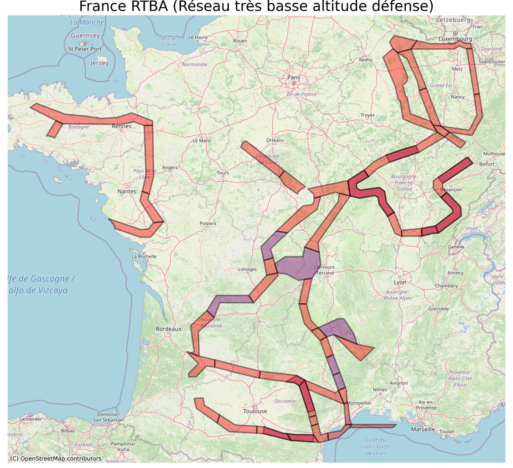
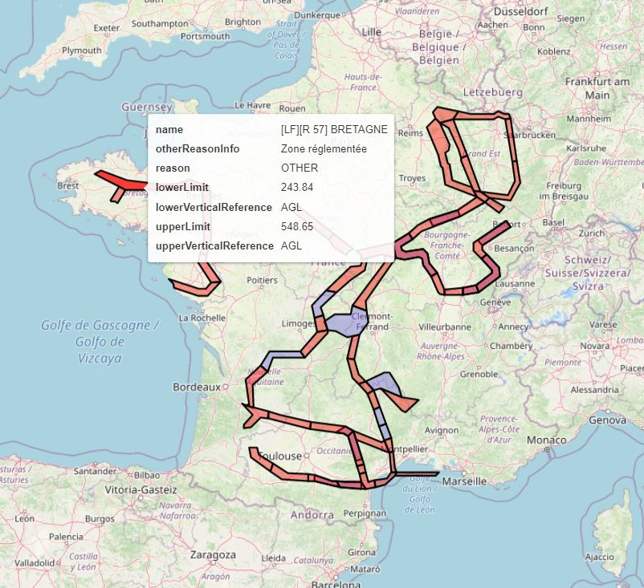

# RTBA (French Defence Very Low Altitude Network)

The RTBA (in French "Réseau Très Basse Altitude défense") is composed of a number of restricted airspace volumes that are linked and used for military high-speed training at very low altitude over Metropolitan France.

The lateral and vertical limits of these airspace volumes are defined in Aeronautical Information Publication (AIP) section ENR5.1 provided by the French Aeronautical Information Service [SIA](https://www.sia.aviation-civile.gouv.fr/).

The goal of this Python script is to save these airspace data as a GeoJSON file, and to visualize the lateral zones on maps.  

Example 1: visualize RTBA airspace sections on France map

Example 2: visualize RTBA airspace with information on interactive map

## Running the tests

Run the notebook rtba.ipynb to load airspace data and visualize RTBA on maps

## Built With

The following Python libraries are used in these notebooks:
* [pandas](https://pandas.pydata.org/) - Python Data Analysis Library
* [GeoPandas](https://geopandas.org/en/stable/) - GeoPandas is an open source project which extends the datatypes used by pandas to allow spatial operations on geometric types.
* [contextily](https://github.com/darribas/contextily) - Context geo-tiles in Python

## Versions

This code was tested with following versions:
* rtba.ipynb: Python 3.9.4, pandas 1.3.4, geopandas 0.10.2, contextily 1.1.0, shapely 1.7.1

## Authors

* **Thomas Dubot** 

## License

This project is licensed under the MIT License - see the [LICENSE.md](LICENSE.md) file for details

## Acknowledgments

Aeronautical Information Publication data are published by by the French Aeronautical Information Service SIA here: https://www.sia.aviation-civile.gouv.fr/

